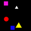

# Interactive-Spriteworld
Extension of the spriteworld environment (https://github.com/google-deepmind/spriteworld). Includes rudimental physics and interactive tasks

## Description
The environment consists of a square arena with a black background and five objects. At the beginning of every episode, the shape of each object is sampled from a discrete and uniform distribution of three shapes (circle, square, and triangle), the position is sampled from a continuous distribution covering the entire space, and the (plain) color is sampled from a continuous distribution along three channels (HSV). The agent is represented by a white sprite of smaller size. This agent can take one of four possible actions (move down, up, left, or right) and moves other objects by colliding with them. 

## Task 1 (Goal Finding)

In this task the agent has to reach the (only) sprite carachterized by the red color.


## Task 2 (Goal Finding Interactive)

In this task the agent has to move the (only) sprite carachterized by the red color to the (only) sprite carachterized by the yellow color.



## Task 3 (Clustering By Shape)

In this task the agent has group the sprites based on their shape. It is supposed to join the right group (based on its shape) in order to complete the task.


## Task 4 (Clustering By Color)

In this task the agent has group the sprites based on their color. 


## How to use this repo
In order to use this project it is essential to first clone the original spriteworld repository (https://github.com/google-deepmind/spriteworld). At this point, it is sufficient to merge the folders 'spriteworld' with that of te original repository and move the folder 'tasks' under the directory 'spriteworld/config' (in the original repo).

To install all the dependencies run the following command:
 
``` pip install -r requirements. txt ```